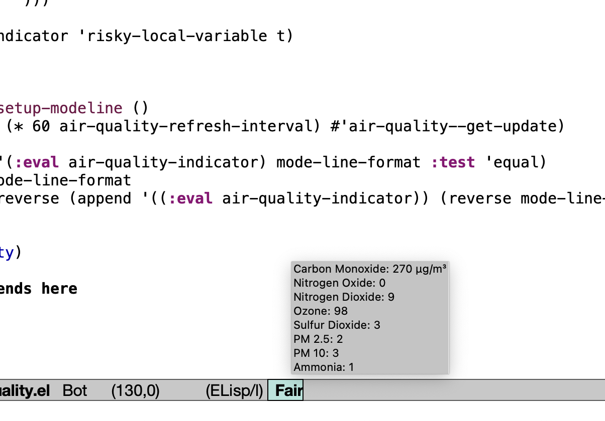

# `air-quality`

Modeline indicator to display air quality information in Emacs. Does not use any third-party packages.

## Requirements

- A recent version of Emacs
- Internet connectivity
- An Open Weather API key (free)

## Installation

Install from Github via [straight.el](https://github.com/radian-software/straight.el) until the software is available on MELPA or ELPA.

```emacs-lisp
(use-package air-quality
  :straight (:host github :repo "jthaman/air-quality")
  :init
  (setq air-quality-open-weather-api-key "<your API key>")
  (setq air-quality-latitude 38) ; for example
  (setq air-quality-longitude -77) ; for example
  :config
  (air-quality-setup-modeline))
```

You might prefer `:vc` use-package keyword in Emacs 30+ or Elpaca.

## Outcome


